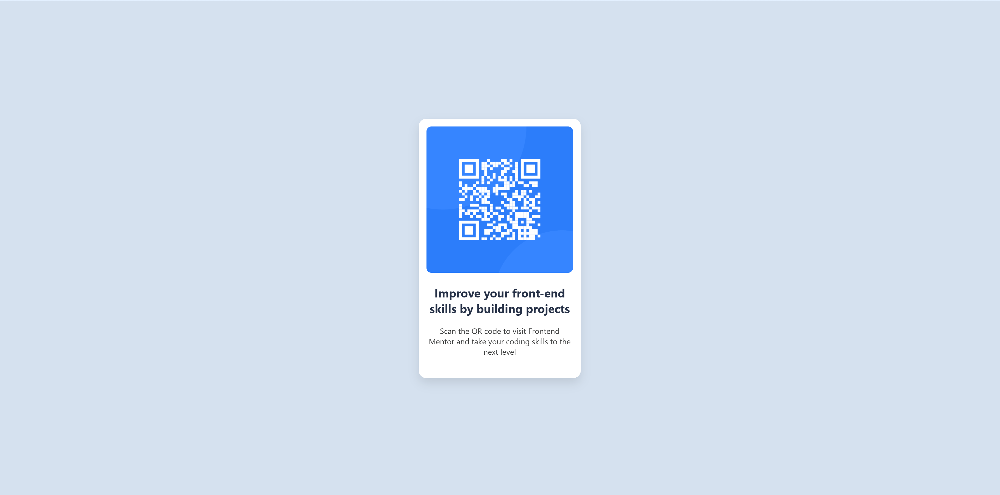

# 📱 QR Code Component

This is a solution to the [QR code component challenge on Frontend Mentor](https://www.frontendmentor.io/challenges/qr-code-component-iux_sIO_H).  
The goal is to build a clean and centered QR code card using **HTML** and **CSS** only — no JavaScript involved.

---

## 🖼️ Preview

> Make sure the above images exist at: `images/Desktop-View.png` and `images/Mobile-View.png`.

---

## 🌐 Live Demo

🔗 [Click here to view live project](https://your-username.github.io/css-projects/Frontend%20Mentor/QR-code-component-main/)

> Replace `your-username` with your actual GitHub username if you publish with GitHub Pages.

---

## 🔧 Built With

- Semantic HTML5  
- CSS Flexbox  
- Mobile-first design  
- Clean and minimal layout principles

---

## 📁 Folder Structure

